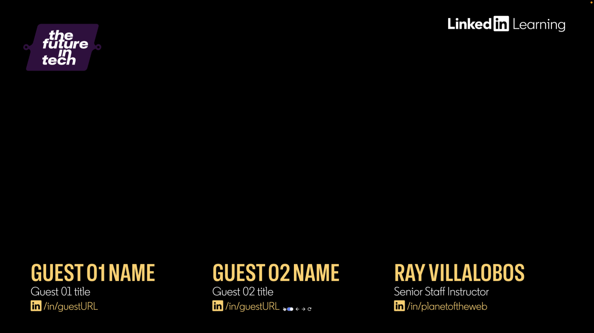
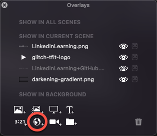

# Streaming Titles for ECAMM Live


ECAMM Live lets you add titles to your livestreams, but if you're running a show with multiple guests and you want to have the titles appear in multiple scenes, it's a bit tought to update each show with the different guests titles. You can add a [widget overlay](https://learn.ecamm.com/ecamm-live-manual/006-using-overlays/#widget-overlays), which is just a link to a website.

This project lets you use a widget overlay configurable in one of two ways. The first is a JSON file called [stream.json](stream.json) with information like this.

```json
{
  "host": {
    "name": "Ray Villalobos",
    "title": "Senior Staff Instructor",
    "profile": "/in/planetoftheweb",
  },
  "guests": [
    {
      "name": "Guest 01 Name",
      "title": "Guest 01 title",
      "profile": "/in/guest01URL"
    },{
      "name": "Guest 02 Name",
      "title": "Guest 02 title",
      "profile": "/in/guest02URL"
    }
  ]
}
```

## URL Parameters

The second way to pass information is with several URL parameters on the `index.html` file inside the `x-data` attribute. The optional variables are as follows (defaults are shown):

```json
  sh: true, //show host
  sg: true, //show guest
  wg: null, //which guest
  pt: 0, //padding top
  pl: 0, //padding left
  pr: 0, // padding right
  dn: true, // display name
  dt: true, // display title
  dp: true // display profile
```

By default it will showup the guests to the left and the host on the right. The colors of the text is configurable in the css/style.css CSS file.

```css
:root {
  --yellow: rgba(255,212,121,1);
  --primary: var(--yellow);
  --secondary: white;
  --tertiary: var(--yellow);
  --quaternary: white;
}
```

## Librares Included

I'm using [Alpine.js](https://alpinejs.dev/) to read the file, so although no build process is necessary, I did include Vite for some live reloading during development. 

I also included the [Preflight](https://tailwindcss.com/docs/preflight) reset from [Tailwind CSS](https://tailwindcss.com/) to make it easier to style the page. I find it cleans things up nicely to start from scratch.

I've also added my favorite icons as fonts from [Bootstrap Icons](https://icons.getbootstrap.com/). For the font, I'm using a fantastic variable weight font from GitHub called [Hubot Sans](https://github.com/mona-sans), feel free to update this with whatever font you want in the [CSS file](css/style.css).

## Usage

1. Clone the repo
2. Customize the `stream.json` file along with anything else you want.
3. Open the index.html file in a browser.
4. Copy the URL to the file.
5. Open up ECAMM Live



6. Add a widget overlay.
7. Paste the URL into the Widget URL box.
8. Customize by adding URL variables like: `?pt=850&pl=100&pr=100`

